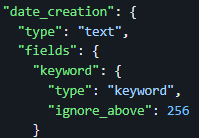
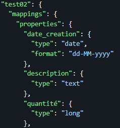

# Elasticsearch

# Partie 1 : Installation et Configuration du Cluster Elasticsearch Objectifs

- Installer et configuration de Elasticsearch sur un cluster de 3 noeuds avec Docker-compose :

```
version: '3.8'
services:
  es01:
    image: docker.elastic.co/elasticsearch/elasticsearch:7.14.0
    container_name: es01
    environment:
      - node.name=es01
      - cluster.name=es-docker-cluster
      - discovery.seed_hosts=es02,es03
      - cluster.initial_master_nodes=es01,es02,es03
      - bootstrap.memory_lock=true
      - "ES_JAVA_OPTS=-Xms256m -Xmx256m"
    ulimits:
      memlock:
        soft: -1
        hard: -1
    volumes:
      - esdata1:/usr/share/elasticsearch/data
    ports:
      - 9200:9200
    networks:
      - elasticsearch-network
  es02:
    image: docker.elastic.co/elasticsearch/elasticsearch:7.14.0
    container_name: es02
    environment:
      - node.name=es02
      - cluster.name=es-docker-cluster
      - discovery.seed_hosts=es01,es03
      - cluster.initial_master_nodes=es01,es02,es03
      - bootstrap.memory_lock=true
      - "ES_JAVA_OPTS=-Xms256m -Xmx256m"
    ulimits:
      memlock:
        soft: -1
        hard: -1
    volumes:
      - esdata2:/usr/share/elasticsearch/data
    networks:
      - elasticsearch-network
  es03:
    image: docker.elastic.co/elasticsearch/elasticsearch:7.14.0
    container_name: es03
    environment:
      - node.name=es03
      - cluster.name=es-docker-cluster
      - discovery.seed_hosts=es01,es02
      - cluster.initial_master_nodes=es01,es02,es03
      - bootstrap.memory_lock=true
      - "ES_JAVA_OPTS=-Xms256m -Xmx256m"
    ulimits:
      memlock:
        soft: -1
        hard: -1
    volumes:
      - esdata3:/usr/share/elasticsearch/data
    networks:
      - elasticsearch-network
volumes:
  esdata1:
    driver: local
  esdata2:
    driver: local
  esdata3:
    driver: local
networks:
  elasticsearch-network:

```

- Lancez le cluster en utilisant la commande suivante :

```
docker-compose up -d
```

- Vérifier que le cluster est bien formé en utilisant la commande suivante :

```
curl -X GET "localhost:9200/_cat/nodes?v=true&pretty"
```

# Partie 2 : Premiers Pas avec le Cluster Elasticsearch Objectifs

- Créer un index nommé test01 avec 3 shards et 1 réplica :

```
curl -X PUT "localhost:9200/test01" -H 'Content-Type: application/json' -d'
```

- Vérifier que cet index est maintenant présent dans le cluster :

```
curl -XGET "http://localhost:9200/_cat/indices?v"
```

- Créer un document dans l'index test01 :

```
{
  "titre": "Premier document",
  "description": "C'est la première fois que je crée un document dans ES.",
  "quantité": 12,
  "date_creation": "10-05-2024"
}
```

- Afficher le document créé :

```
curl -X GET "localhost:9200/test01/_doc/1?pretty"
```

- Afficher quel mapping a été appliquer par défaut sur l'index test01, est-il optimal ?

```
curl -X GET "localhost:9200/test01/_mapping?pretty"
```

Non, le mapping par défaut n'est pas optimal, il a appliqué le type text sur tous les champs, or le champ date_creation
devrait être de type date et le champ quantité devrait être de type integer.



- Supprimer l'index test01 :

```
curl -X DELETE "localhost:9200/test01"
```

- Créer un index nommé test02:

```
curl -X PUT "localhost:9200/test02" -H 'Content-Type: application/json' -d'
```

```
{
  "mappings": {
    "properties": {
      "titre": {
        "type": "text"
      },
      "description": {
        "type": "text"
      },
      "quantité": {
        "type": "integer"
      },
      "date_creation": {
        "type": "date",
        "format": "dd-MM-yyyy"
      }
    }
```

- Vérifier que cet index est maintenant présent dans le cluster :

```
curl -XGET "http://localhost:9200/_cat/indices?v"
```

- Créer un document dans l'index test02 :

```
{
  "titre": "Deuxième document",
  "description": "C'est la deuxième fois que je crée un document dans ES.",
  "quantité": 5,
  "date_creation": "15-06-2024"
}
```

- Afficher le document créé :

```
curl -X GET "localhost:9200/test02/_doc/1?pretty"
```

- Afficher quel mapping a été appliquer par défaut sur l'index test02, est-il optimal ?

```
curl -X GET "localhost:9200/test02/_mapping?pretty"
```

Oui, le mapping appliqué est optimal.



- Afficher la manière dont le texte de la description du document a été traité par l'analyzer

```
curl -X GET "localhost:9200/test02/_analyze?pretty" -H 'Content-Type: application/json' -d'
```

le .json suivant :

```
{
  "field": "description",
  "text": "C'est la deuxième fois que je crée un document dans ES."
}
```
```
{
  "tokens": [
    {
      "token": "c'est",
      "start_offset": 0,
      "end_offset": 5,
      "type": "<ALPHANUM>",
      "position": 0
    },
    {
      "token": "la",
      "start_offset": 6,
      "end_offset": 8,
      "type": "<ALPHANUM>",
      "position": 1
    },
    {
      "token": "première",
      "start_offset": 9,
      "end_offset": 17,
      "type": "<ALPHANUM>",
      "position": 2
    },
    {
      "token": "fois",
      "start_offset": 18,
      "end_offset": 22,
      "type": "<ALPHANUM>",
      "position": 3
    },
    {
      "token": "que",
      "start_offset": 23,
      "end_offset": 26,
      "type": "<ALPHANUM>",
      "position": 4
    },
    {
      "token": "je",
      "start_offset": 27,
      "end_offset": 29,
      "type": "<ALPHANUM>",
      "position": 5
    },
    {
      "token": "crée",
      "start_offset": 30,
      "end_offset": 34,
      "type": "<ALPHANUM>",
      "position": 6
    },
    {
      "token": "un",
      "start_offset": 35,
      "end_offset": 37,
      "type": "<ALPHANUM>",
      "position": 7
    },
    {
      "token": "document",
      "start_offset": 38,
      "end_offset": 46,
      "type": "<ALPHANUM>",
      "position": 8
    },
    {
      "token": "dans",
      "start_offset": 47,
      "end_offset": 51,
      "type": "<ALPHANUM>",
      "position": 9
    },
    {
      "token": "es",
      "start_offset": 52,
      "end_offset": 54,
      "type": "<ALPHANUM>",
      "position": 10
    }
  ]
}
```

- Créer un index nommé test03 :

```
curl -X PUT "localhost:9200/test03" -H 'Content-Type: application/json' -d'
```

- Appliquer un mapping plus adapté aux données du document ci-dessus

```
  {
  "mappings": {
    "properties": {
      "titre": { "type": "text" },
      "description": {
        "type": "text",
        "fields": {
          "raw": { "type": "keyword" },
          "no_stopwords": {
            "type": "text",
            "analyzer": "stop"
          }
        }
      },
      "quantité": { "type": "integer" },
      "date_creation": {
        "type": "date",
        "format": "dd-MM-yyyy"
      }
    }
  }
}'
```

- Vérifier que cet index est maintenant présent dans le cluster :

```
curl -XGET "http://localhost:9200/_cat/indices?v"
```

- Créer un document dans l'index test03 :

```
{
  "titre": "Troisième document",
  "description": "C'est la troisième fois que je crée un document dans ES.",
  "quantité": 8,
  "date_creation": "20-07-2024"
}
```

- Afficher le document créé :

```
curl -X GET "localhost:9200/test03/_doc/1?pretty"
```

- Afficher quel mapping a été appliquer par défaut sur l'index test03, est-il optimal ?

```
curl -X GET "localhost:9200/test03/_mapping?pretty"
```

# Partie 3 : Recherche dans le Cluster Elasticsearch Objectifs

- Intégrer les données factices fournies:

    ```
    curl -X POST "localhost:9200/test03/_doc/2" -H 'Content-Type: application/json' -d'
    {
      "titre": "Quatrième document",
      "description": "C'est la quatrième fois que je crée un document dans ES.",
      "quantité": 3,
      "date_creation": "25-08-2024"
    }
  
- Utilisation de Kibana pour les Requêtes

On accède à Kibana en allant sur l'URL suivante : http://localhost:5601 et on clique sur "Dashboard".

```
GET /flights/_search
{
  "query": {
    "range": {
      "average_price": {
        "gte": 300,
        "lte": 450
      }
    }
  }
}
```

Lister les vols annulés

```
GET /flights/_search
{
  "query": {
    "term": {
      "status": "cancelled"
    }
  }
}
```

Lister les vols où il pleut à l'arrivée ou au départ. Les vols avec de la pluie à l'arrivée devront sortir avant les autres.

```
GET /flights/_search
{
  "query": {
    "bool": {
      "should": [
        { "term": { "weather_departure": "rain" } },
        { "term": { "weather_arrival": "rain" } }
      ]
    }
  },
  "sort": [
    { "weather_arrival": { "order": "desc" } }
  ]
}
```

Lister les vols partant d'Allemagne et à destination de France

```
GET /flights/_search
{
  "query": {
    "bool": {
      "must": [
        { "term": { "departure_country": "Germany" } },
        { "term": { "arrival_country": "France" } }
      ]
    }
  }
}
```

Lister les vols ayant eu lieu entre le 1er avril 2024 et le 20 mai 2024

```
GET /flights/_search
{
  "query": {
    "range": {
      "flight_date": {
        "gte": "2024-04-01",
        "lte": "2024-05-20"
      }
    }
  }
}
```

